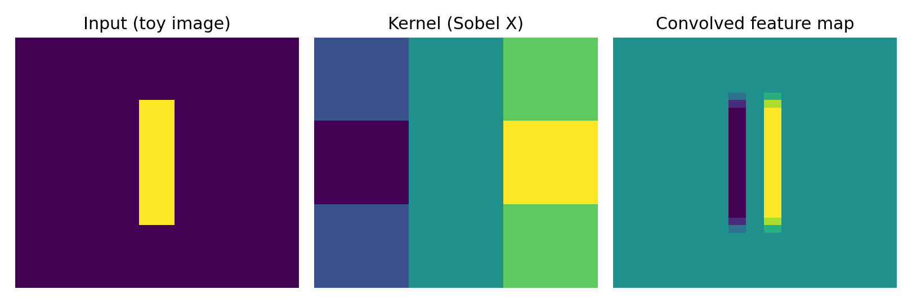
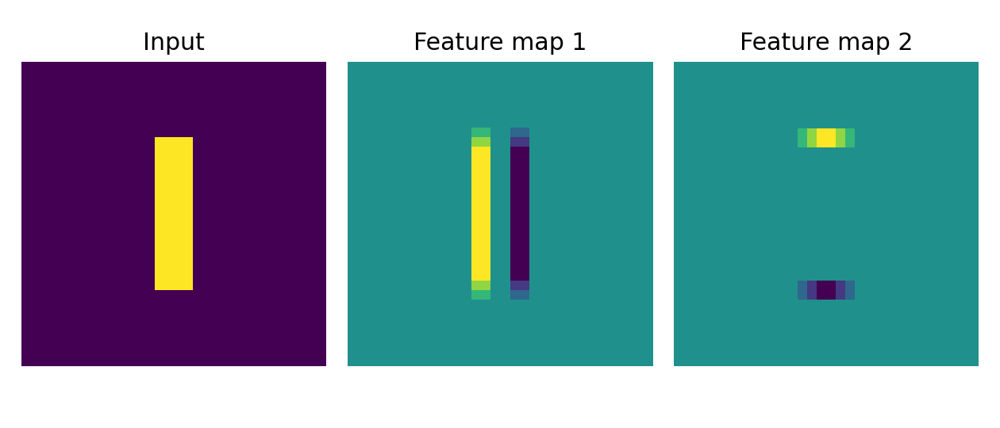
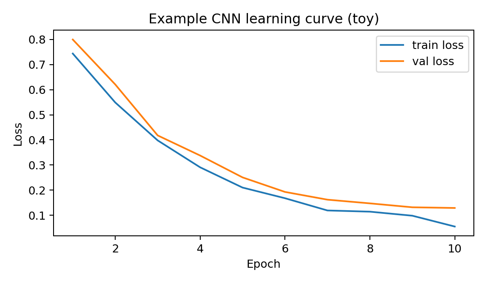

# Task 1 — Convolutional Neural Network (CNN)

## What is a CNN?
A **convolutional neural network (CNN)** is a neural network architecture specialized for learning patterns in data
that has a **grid-like structure** (images, spectrograms) or can be treated as local neighborhoods (1D sequences such as
bytes, characters, or time series). Unlike fully-connected networks (MLP), CNNs use **convolutional layers** that apply
small learnable filters (kernels) across the input. This creates three key advantages:

1. **Local receptive fields:** kernels look at small regions (e.g., 3×3) and learn local features (edges, shapes, n-grams).
2. **Parameter sharing:** the same kernel is reused across the whole input, greatly reducing parameters and overfitting.
3. **Translation equivariance:** if a pattern moves in the input, the feature map changes in a predictable way.

A typical CNN pipeline is:
- **Convolution** (kernel * input) → **feature maps**
- **Nonlinearity** (ReLU) to make the model expressive
- **Pooling** (max/avg) to downsample and add robustness to small shifts
- **Stack multiple conv blocks** to build hierarchies (edges → motifs → objects)
- **Classifier head** (dense layers) to output class probabilities

CNNs are not only for images. In cybersecurity, 1D CNNs are often used for **URL strings, packet payloads, byte
sequences**, and other data where **local patterns** reveal malicious behavior.

---

## Visualizations (how convolution creates feature maps)

### Convolution in one picture


### Multiple feature maps (multiple kernels)


### Example learning curve (toy)


---

## Practical cybersecurity example: Malicious URL detection with a 1D CNN

### Dataset (included in this report)
Below is a tiny labeled dataset (benign vs malicious). In real projects you would use a larger dataset, but this
mini-example demonstrates the workflow end-to-end.

```python
# label: 0 = benign, 1 = malicious
data = [
  ("https://www.google.com/search?q=alfa", 0),
  ("https://bank.ge/login", 0),
  ("https://github.com/login", 0),
  ("https://news.ge/article/12345", 0),
  ("http://secure-paypal.com.verify-login.ru/auth", 1),
  ("http://account-update.bank-ge.com/login.php", 1),
  ("http://free-gift-cards.ru/win/iphone15", 1),
  ("http://xn--pple-43d.com/verify", 1),
  ("http://login.microsoftonline.com.secure-session.io", 1),
  ("http://update-security-check.com/confirm", 1),
]
```

### Full source code (data + training)
> Requirements: `pip install tensorflow numpy matplotlib`

```python
import numpy as np
import tensorflow as tf
from tensorflow.keras import layers

# ---- Data ----
data = [
  ("https://www.google.com/search?q=alfa", 0),
  ("https://bank.ge/login", 0),
  ("https://github.com/login", 0),
  ("https://news.ge/article/12345", 0),
  ("http://secure-paypal.com.verify-login.ru/auth", 1),
  ("http://account-update.bank-ge.com/login.php", 1),
  ("http://free-gift-cards.ru/win/iphone15", 1),
  ("http://xn--pple-43d.com/verify", 1),
  ("http://login.microsoftonline.com.secure-session.io", 1),
  ("http://update-security-check.com/confirm", 1),
]

urls = [u for u, y in data]
labels = np.array([y for u, y in data], dtype=np.int32)

# ---- Character-level vectorization ----
max_len = 80
vocab = list("abcdefghijklmnopqrstuvwxyz0123456789-._/:?=&%")
lookup = {ch:i+1 for i, ch in enumerate(vocab)}  # 0 reserved for padding

def encode_url(u: str) -> np.ndarray:
    u = u.lower()[:max_len]
    arr = np.zeros((max_len,), dtype=np.int32)
    for i, ch in enumerate(u):
        arr[i] = lookup.get(ch, 0)
    return arr

X = np.stack([encode_url(u) for u in urls], axis=0)

# small train/val split
idx = np.arange(len(X))
np.random.seed(0)
np.random.shuffle(idx)
split = int(0.8 * len(X))
train_idx, val_idx = idx[:split], idx[split:]

X_train, y_train = X[train_idx], labels[train_idx]
X_val, y_val = X[val_idx], labels[val_idx]

# ---- 1D CNN model ----
model = tf.keras.Sequential([
    layers.Embedding(input_dim=len(vocab)+1, output_dim=16, input_length=max_len),
    layers.Conv1D(filters=32, kernel_size=5, activation="relu"),
    layers.MaxPool1D(pool_size=2),
    layers.Conv1D(filters=64, kernel_size=5, activation="relu"),
    layers.GlobalMaxPool1D(),
    layers.Dense(32, activation="relu"),
    layers.Dense(1, activation="sigmoid"),
])

model.compile(optimizer="adam", loss="binary_crossentropy", metrics=["accuracy"])
history = model.fit(X_train, y_train, validation_data=(X_val, y_val), epochs=10, verbose=1)

# ---- Test a few URLs ----
tests = [
    "https://accounts.google.com",
    "http://paypal.com.verify-me.ru/login",
    "https://mybank.ge/profile",
    "http://security-update-check.com/reset",
]
Xt = np.stack([encode_url(u) for u in tests])
pred = model.predict(Xt).reshape(-1)

for u, p in zip(tests, pred):
    print(f"{u} -> malicious probability = {p:.3f}")
```

### Why CNN helps here
Malicious URLs often contain **local character patterns** such as:
- suspicious subdomains (`login.microsoftonline.com.secure-...`)
- strange delimiters, repeated hyphens, unusual TLDs
- deceptive keywords (`verify`, `secure`, `update`) near brand names

A 1D CNN learns these **local n-gram-like features** automatically from the character sequence.

---

## Reproducible figure generation (optional)
The visualizations above were generated using simple convolution demos in Python (see below).

```python
import numpy as np
import matplotlib.pyplot as plt
from scipy.signal import convolve2d

img = np.zeros((32,32))
img[8:24, 14:18] = 1

kernel = np.array([[-1,0,1],[-2,0,2],[-1,0,1]])
conv = convolve2d(img, kernel, mode="same")

plt.figure(figsize=(9,3))
plt.subplot(1,3,1); plt.imshow(img); plt.title("Input"); plt.axis("off")
plt.subplot(1,3,2); plt.imshow(kernel); plt.title("Kernel"); plt.axis("off")
plt.subplot(1,3,3); plt.imshow(conv); plt.title("Feature map"); plt.axis("off")
plt.tight_layout()
plt.savefig("images/convolution_demo.png", dpi=180)
plt.close()
```
