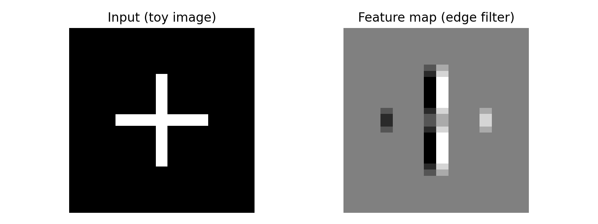
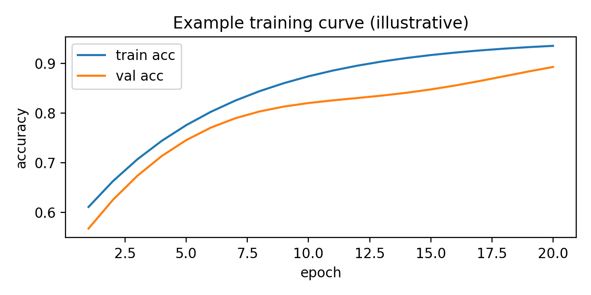

# Task 1 — Convolutional Neural Networks (CNN)

## What a CNN is
A **convolutional neural network (CNN)** is a neural network that learns **local patterns** by applying small trainable filters (kernels) across an input. The key idea is the **convolution** operation: instead of connecting every input value to every neuron (as in a fully connected network), a CNN slides a small kernel over the input and computes dot-products. This creates **feature maps** that highlight useful structures such as edges in images, local motifs in audio, or character n-grams in text/URLs.

A typical CNN pipeline includes:
- **Convolution layers** (learn filters; output feature maps)
- **Non-linearity** (e.g., ReLU) to model complex functions
- **Pooling** (max/avg pooling) to downsample and add small translation invariance
- **Normalization / regularization** (BatchNorm, Dropout) to stabilize training and reduce overfitting
- **Classifier head** (dense layers) to map features to labels

CNNs are powerful because they exploit **weight sharing** (the same kernel is reused across positions) and **local receptive fields**, which reduces parameters and helps generalization.

## Visualizations
### 1) 1D convolution effect (toy signal)


### 2) 2D feature map (toy edge detector)


### 3) Example training curve (illustrative)


---

## Practical cybersecurity example: phishing URL detection with a 1D CNN
One practical use of CNNs in cybersecurity is **phishing URL classification**. Many phishing URLs contain suspicious character patterns (e.g., excessive delimiters, misleading subdomains, brand names + random strings). A **character-level 1D CNN** can learn these local patterns similarly to how it learns edges in images.

Below is a minimal, reproducible example: it includes a tiny dataset, preprocessing, and a simple Keras 1D CNN model.

### Dataset (small demo)
```python
data = [
  # benign (0)
  ("https://accounts.google.com/signin", 0),
  ("https://www.microsoft.com/en-us/", 0),
  ("https://bankofgeorgia.ge/ka", 0),
  ("https://github.com/login", 0),
  ("https://docs.python.org/3/", 0),

  # phishing/suspicious (1)
  ("http://goog1e-security-login.com/verify", 1),
  ("http://microsoft-support-login.verify-account.ru", 1),
  ("http://bankofgeorgia.ge.secure-login.info/auth", 1),
  ("http://paypal.com.user.verify-session.cc/login", 1),
  ("http://appleid.apple.com.signin.confirmation.xyz/", 1),
]
```

### Full Python code (training + evaluation)
```python
import numpy as np
import tensorflow as tf
from tensorflow.keras import layers, models

# ---- data ----
data = [
  ("https://accounts.google.com/signin", 0),
  ("https://www.microsoft.com/en-us/", 0),
  ("https://bankofgeorgia.ge/ka", 0),
  ("https://github.com/login", 0),
  ("https://docs.python.org/3/", 0),
  ("http://goog1e-security-login.com/verify", 1),
  ("http://microsoft-support-login.verify-account.ru", 1),
  ("http://bankofgeorgia.ge.secure-login.info/auth", 1),
  ("http://paypal.com.user.verify-session.cc/login", 1),
  ("http://appleid.apple.com.signin.confirmation.xyz/", 1),
]

urls = [u for u, y in data]
labels = np.array([y for u, y in data], dtype=np.int32)

# ---- char-level vectorization ----
# build a small charset from the data
charset = sorted(set("".join(urls)))
char2idx = {c:i+1 for i,c in enumerate(charset)}  # 0 is padding
max_len = 80

def encode(url: str) -> np.ndarray:
    x = np.zeros(max_len, dtype=np.int32)
    for i, ch in enumerate(url[:max_len]):
        x[i] = char2idx.get(ch, 0)
    return x

X = np.stack([encode(u) for u in urls])

# simple train/test split (tiny demo)
X_train, y_train = X[:8], labels[:8]
X_test,  y_test  = X[8:], labels[8:]

vocab_size = len(char2idx) + 1

# ---- model: Embedding -> Conv1D -> Pool -> Dense ----
model = models.Sequential([
    layers.Input(shape=(max_len,)),
    layers.Embedding(input_dim=vocab_size, output_dim=16),
    layers.Conv1D(filters=32, kernel_size=5, activation="relu"),
    layers.MaxPooling1D(pool_size=2),
    layers.Conv1D(filters=64, kernel_size=5, activation="relu"),
    layers.GlobalMaxPooling1D(),
    layers.Dropout(0.2),
    layers.Dense(32, activation="relu"),
    layers.Dense(1, activation="sigmoid"),
])

model.compile(optimizer="adam", loss="binary_crossentropy", metrics=["accuracy"])
history = model.fit(X_train, y_train, epochs=25, batch_size=4, verbose=0)

# ---- evaluation ----
loss, acc = model.evaluate(X_test, y_test, verbose=0)
print("Test accuracy:", acc)

# ---- inference example ----
test_url = "http://google.com.secure-login-check.xyz/signin"
pred = model.predict(np.expand_dims(encode(test_url), 0), verbose=0)[0,0]
print("Suspicious probability:", float(pred))
```

### Notes
- This is a **small educational dataset** to demonstrate the workflow. In real projects you would use thousands of labeled URLs and proper validation.
- The important idea is that **Conv1D kernels** learn character-pattern features (like n-grams) that are predictive for phishing.

