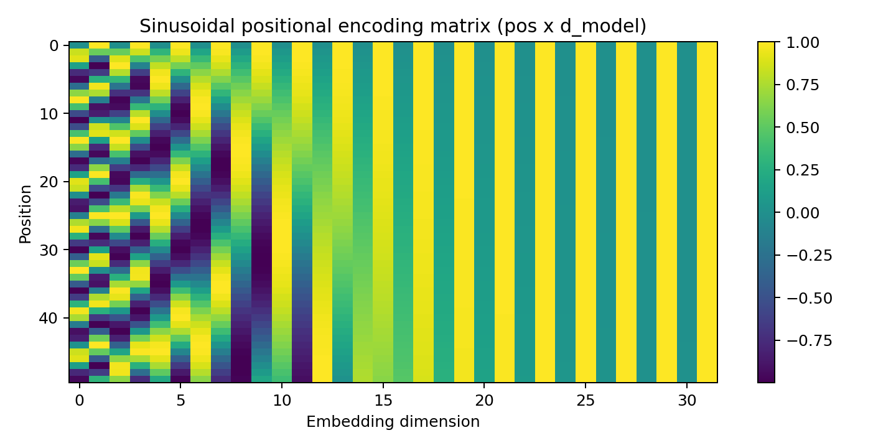
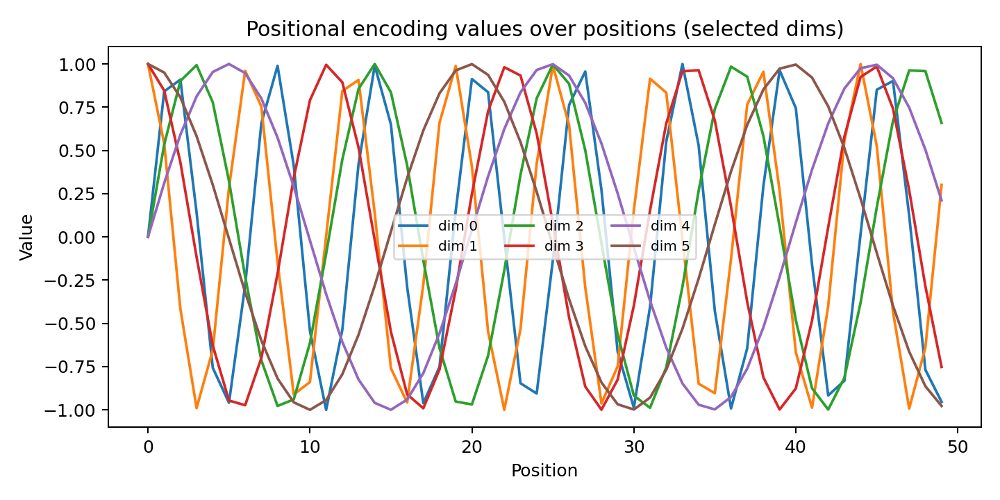

# Task 2 — Transformer network and cybersecurity applications

## What is a Transformer?
A **Transformer** is a neural network architecture designed to model sequences (text, logs, events, API calls) using
**self-attention** instead of recurrence (RNN/LSTM) or convolution. The core idea is that each token in a sequence can
**directly attend** to every other token and learn which context is important. This makes Transformers highly effective
for long-range dependencies, parallelizable training, and strong representation learning.

A standard Transformer block contains:
- **Token embeddings** (turn tokens into vectors)
- **Positional encoding** (inject order information)
- **Multi-head self-attention** (learn multiple interaction patterns in parallel)
- **Feed-forward network** (nonlinear transformation per token)
- **Residual connections + layer normalization** (stability and deeper training)

### Why positional encoding?
Self-attention alone is permutation-invariant: if you shuffle tokens, attention still “works”, but order is lost.
**Positional encoding** adds deterministic sin/cos patterns (or learned vectors) so the model can learn patterns like
“failed login *after* password reset” or “sequence of commands”.

---

## Applications in cybersecurity
Transformers are widely applicable because cyber data is often sequential and context-dependent:

- **Phishing / malicious text detection:** classify emails, URLs, and messages based on semantics and intent.
- **Log anomaly detection:** model sequences of events (auth, network, EDR) and detect unusual patterns.
- **SIEM alert correlation:** summarize and connect alerts across time, users, IPs, and hosts.
- **Threat hunting / IOC enrichment:** extract entities (IPs, hashes, domains) and relate them to incidents.
- **Code & script analysis:** detect suspicious PowerShell/Bash patterns, obfuscation, or malware-like code behavior.

In practice, a Transformer can take sequences like:
`[user, action, resource, status, ip]` or plain text logs and learn normal behavior; large deviations in predicted next
tokens or embedding space may indicate attacks.

---

## Visualization 1 — Self-attention mechanism (toy example)


The heatmap shows how each token distributes attention across other tokens (rows sum to 1).

## Visualization 2 — Positional encoding
### Matrix view


### Selected dimensions over positions


---

## Reproducible Python code (generates the figures above)
```python
import numpy as np
import matplotlib.pyplot as plt

# ---- Attention heatmap (toy) ----
tokens = ["[CLS]","login","failed","from","192.168.1.10","multiple","times"]
n = len(tokens)

np.random.seed(2)
att = np.random.rand(n, n)
att = att / att.sum(axis=1, keepdims=True)

plt.figure(figsize=(6.5,5.5))
plt.imshow(att, aspect="auto")
plt.xticks(range(n), tokens, rotation=45, ha="right")
plt.yticks(range(n), tokens)
plt.colorbar()
plt.title("Example self-attention weights (toy)")
plt.tight_layout()
plt.savefig("images/attention_heatmap.png", dpi=180)
plt.close()

# ---- Sinusoidal positional encoding ----
d_model = 32
max_len = 50
pos = np.arange(max_len)[:, None]
i = np.arange(d_model)[None, :]

angle_rates = 1 / np.power(10000, (2 * (i // 2)) / d_model)
angles = pos * angle_rates

pe = np.zeros_like(angles)
pe[:, 0::2] = np.sin(angles[:, 0::2])
pe[:, 1::2] = np.cos(angles[:, 1::2])

plt.figure(figsize=(8,4))
plt.imshow(pe, aspect="auto")
plt.colorbar()
plt.title("Sinusoidal positional encoding matrix (pos x d_model)")
plt.xlabel("Embedding dimension")
plt.ylabel("Position")
plt.tight_layout()
plt.savefig("images/positional_encoding_matrix.png", dpi=180)
plt.close()

plt.figure(figsize=(8,4))
for dim in [0,1,2,3,4,5]:
    plt.plot(pos.squeeze(), pe[:, dim], label=f"dim {dim}")
plt.title("Positional encoding values over positions (selected dims)")
plt.xlabel("Position")
plt.ylabel("Value")
plt.legend(ncol=3, fontsize=8)
plt.tight_layout()
plt.savefig("images/positional_encoding_curves.png", dpi=180)
plt.close()
```
