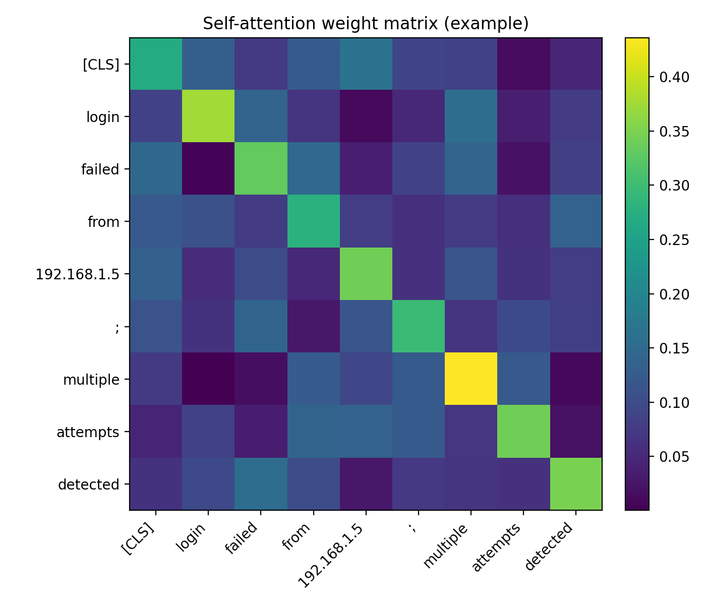
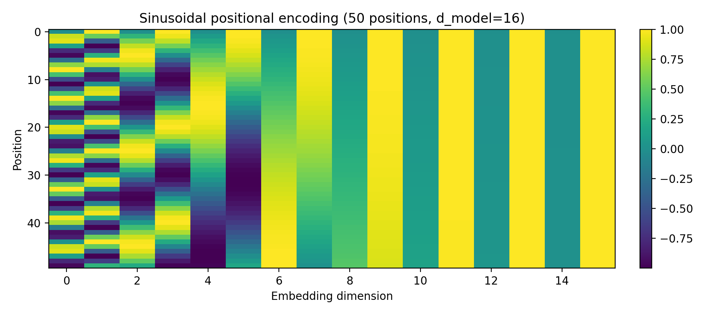

# Task 2 — Transformer networks (and cybersecurity applications)

## What a transformer is
A **transformer** is a neural network architecture designed for sequence modeling (text, logs, network events, byte streams) that avoids recurrence and instead uses **attention** to mix information across positions in the sequence. Unlike RNNs/LSTMs, transformers process a whole sequence in parallel, which makes them efficient on modern hardware and very effective on long contexts.

A standard transformer block contains:
- **Token embeddings** (turn discrete tokens into vectors)
- **Positional encoding** (inject order information, because attention alone is permutation-invariant)
- **Multi-head self-attention** (each head learns different relationships: locality, long-range links, delimiter behavior, etc.)
- **Feed-forward network (FFN)** applied per position
- **Residual connections + LayerNorm** to stabilize deep training
- Often **dropout** for regularization

In self-attention, each token produces **Query (Q), Key (K), Value (V)** vectors. Attention weights are computed by scaled dot-product:
\[
\text{Attention}(Q,K,V)=\text{softmax}\left(\frac{QK^T}{\sqrt{d_k}}\right)V
\]
This lets a token (e.g., an IP address) “look at” other tokens (e.g., a URL path or status code) and aggregate relevant context.

## Cybersecurity applications
Transformers are particularly strong for cybersecurity because many security problems are sequence + context problems:
- **SIEM alert enrichment and correlation** (linking events across time and sources)
- **Phishing / malicious URL detection** from tokenized URLs or email text
- **Web/server log anomaly detection** and event classification
- **Malware family classification** from opcode/byte sequences
- **Incident report summarization** and SOC assistant workflows (LLM-style transformers)
- **Credential stuffing / brute-force patterns** in authentication logs

For example, a transformer can learn that patterns like “multiple failed logins from many IPs” or “sudden bursts of similar requests” are suspicious, even when attackers vary small details.

## Visualizations (generated by Python)
### 1) Attention mechanism (example weight matrix)


### 2) Positional encoding (sin/cos)


## Python code used to generate the visualizations
```python
import numpy as np
import matplotlib.pyplot as plt

# --- Attention heatmap example ---
tokens = ["[CLS]","login","failed","from","192.168.1.5",";","multiple","attempts","detected"]
n = len(tokens)
np.random.seed(7)
A = np.random.rand(n, n)
A = (A + np.eye(n)*1.5)
A = A / A.sum(axis=1, keepdims=True)

fig, ax = plt.subplots(figsize=(7,6))
im = ax.imshow(A)
ax.set_xticks(range(n)); ax.set_yticks(range(n))
ax.set_xticklabels(tokens, rotation=45, ha="right")
ax.set_yticklabels(tokens)
ax.set_title("Self-attention weight matrix (example)")
fig.colorbar(im, ax=ax, fraction=0.046, pad=0.04)
fig.tight_layout()
fig.savefig("images/attention_heatmap.png", dpi=200)
plt.close(fig)

# --- Positional encoding (sinusoidal) ---
d_model = 16
max_len = 50
pos = np.arange(max_len)[:, None]
i = np.arange(d_model)[None, :]
angle_rates = 1 / np.power(10000, (2*(i//2))/d_model)
angles = pos * angle_rates

pe = np.zeros((max_len, d_model))
pe[:, 0::2] = np.sin(angles[:, 0::2])
pe[:, 1::2] = np.cos(angles[:, 1::2])

fig, ax = plt.subplots(figsize=(9,4))
im = ax.imshow(pe, aspect="auto")
ax.set_title("Sinusoidal positional encoding (50 positions, d_model=16)")
ax.set_xlabel("Embedding dimension")
ax.set_ylabel("Position")
fig.colorbar(im, ax=ax, fraction=0.046, pad=0.04)
fig.tight_layout()
fig.savefig("images/positional_encoding.png", dpi=200)
plt.close(fig)
```
