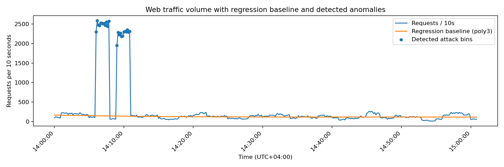
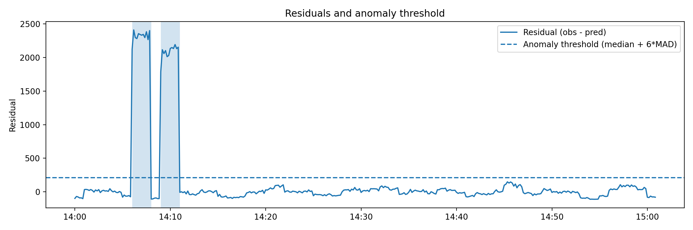

# Task 3 — Web server log analysis (DDoS detection with regression)

**Provided log (original link):** `http://max.ge/aiml_final/t_ebralidze25_36714_server.log`  
**Local copy in this repo:** `t_ebralidze25_36714_server.log`

## Goal
Find the **time interval(s)** where the traffic indicates a **DDoS attack**, using **regression analysis** on traffic volume extracted from the log.

---

## 1) Data extraction
Each log line follows a combined format similar to:

- IP address
- timestamp in brackets: `[YYYY-MM-DD HH:MM:SS+04:00]`
- request: `"METHOD /path HTTP/1.0"`
- status code, response size
- referrer, user-agent
- response time (last numeric field)

Example parsing regex used:

```python
LOG_RE = re.compile(
    r'^(?P<ip>\S+) \S+ \S+ \[(?P<ts>[^\]]+)\] "(?P<method>[A-Z]+) (?P<path>\S+) (?P<proto>[^"]+)" '
    r'(?P<status>\d{3}) (?P<size>\d+) "(?P<ref>[^"]*)" "(?P<ua>[^"]*)" (?P<rt>\d+)\s*$'
)
```

Then I aggregated requests into **10-second bins**:

```python
bin_seconds = 10
df["bin"] = df["ts"].dt.floor(f"{bin_seconds}s")
s = df.groupby("bin").size().rename("req").sort_index()
```

This produces a time series `req(t)` = requests per 10 seconds.

---

## 2) Regression baseline (expected traffic)
To model “normal” traffic trend, I used a **polynomial regression (degree 3)**:

- Let `t` = seconds since the first log entry
- Fit a polynomial to bins assumed to be normal traffic  
  (here: bins with `req <= 90th percentile`)

```python
p90 = np.percentile(y, 90)
train_mask = y <= p90

coef = np.polyfit(t[train_mask], y[train_mask], 3)
yhat = np.polyval(coef, t)         # regression baseline
res  = y - yhat                    # residuals
```

---

## 3) Attack detection rule (regression residuals)
The attack appears as a **large positive residual** where the actual traffic is far above the regression baseline.

I set:
- residual threshold = `99.5th percentile` of residuals on training (normal) bins
- plus a robust volume guard: `median + 10*MAD` to avoid mild spikes

```python
thr_res = np.quantile(res[train_mask], 0.995)

median = np.median(y)
mad = np.median(np.abs(y - median))
thr_vol = median + 10 * mad

is_attack = (res > thr_res) & (y > thr_vol)
```

---

## 4) Detected DDoS interval(s)
Using the rule above, the DDoS traffic bursts are:

- **2024-03-22 18:06:00+0400** to **2024-03-22 18:08:00+0400**
- **2024-03-22 18:09:00+0400** to **2024-03-22 18:11:00+0400**

> Interpretation: the server receives **~2000–2600 requests per 10 seconds** during these windows, while normal bins are typically **~50–200 requests per 10 seconds**.

---

## 5) Visualizations
### Traffic vs regression baseline


### Residuals + threshold


---

## 6) How to reproduce
1. Make sure you have Python 3.10+ and install dependencies:
   ```bash
   pip install pandas numpy matplotlib
   ```

2. Run the detector from `task_3/`:
   ```bash
   python ddos_regression.py t_ebralidze25_36714_server.log
   ```

3. The script prints the intervals and saves plots into `task_3/figures/`.

---

## Files in this folder
- `ddos_regression.py` — full source code
- `t_ebralidze25_36714_server.log` — input event log (copy)
- `figures/traffic_regression.png` — visualization
- `figures/residuals.png` — visualization
